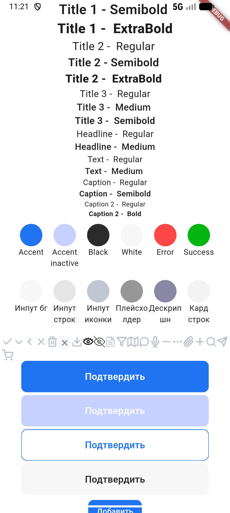

# 🎨 Matule 2026 UI Kit

[](https://flutter.dev)
[](https://dart.dev)
[](https://opensource.org/licenses/MIT)
<p align="center">
</p>

**UI Kit** для мобильного приложения **Matule 2026** – проекта, разрабатываемого в рамках чемпионата «Профессионалы 2026» по компетенции **«Разработка мобильных приложений»**.

Библиотека содержит переиспользуемые визуальные компоненты, соответствующие дизайн-системе Matule. Позволяет быстро собирать экраны и поддерживать единый стиль во всём приложении.

---

## 📦 Состав библиотеки

Компоненты написаны на чистом Dart/Flutter и легко настраиваются под нужные сценарии:

- **Кнопки** – основные, второстепенные, текстовые, иконки
- **Поля ввода** – текстовые поля с валидацией, масками
- **Карточки** – товаров, профилей, заказов
- **Навигационные элементы** – таб-бары, апп-бары
- **Модальные окна** – диалоги, снитч-бары
- **Типографика** – предопределённые стили текста


---

## 🔗 Связанные проекты

| Проект | Описание |
|--------|----------|
| [**network**](https://github.com/DenUP/network) | Клиентская библиотека для работы с API сервера (PocketBase). Содержит сервисы и модели данных. |
| [**my-pocketbase-docker-matule**](https://github.com/DenUP/my-pocketbase-docker-matule) | Готовый Docker-образ с PocketBase и Swagger UI – бэкенд для разработки и тестирования. |
| [**matule-2026-app**](https://github.com/DenUP/matule-2026-app) | Полное мобильное приложение Matule 2026, использующее данный UI Kit и библиотеку network. |

---

## 🚀 Установка

Добавьте зависимость в файл `pubspec.yaml` вашего проекта:

```yaml
dependencies:
  matule2026_ui_kit:
    git:
      url: https://github.com/DenUP/matule2026_ui_kit.git
      ref: main
```

Затем выполните:

```bash
flutter pub get
```

---

## 🧪 Использование

Простой пример использования кнопки и поля ввода:

```dart
import 'package:flutter/material.dart';
import 'package:matule2026_ui_kit/matule2026_ui_kit.dart';

class LoginScreen extends StatelessWidget {
  @override
  Widget build(BuildContext context) {
    return Scaffold(
      body: Padding(
        padding: const EdgeInsets.all(16.0),
        child: Column(
          children: [
            ui.bigButton.accent(
                title: "Подтвердить",
                onTap: () {},
                isActive: false,
              ),
            const SizedBox(height: 12),
            ui.smallButton.delButton(title: "Убрать ", onTap: () {}),
          ],
        ),
      ),
    );
  }
}
```

Все компоненты поддерживают кастомизацию через темы Flutter. Для более детальной информации обратитесь к документации.

---

## 📚 Документация

- [Макет](https://www.figma.com/design/pbwY6r5TtWUkxMsoJBWf0c/Matule-2026?node-id=1-2&p=f&t=UbvogysdatSyD1Zx-0)

---

## 🏆 О чемпионате «Профессионалы 2026»

Проект создан командой разработчиков для участия в чемпионате профессионального мастерства **«Профессионалы»** по компетенции **«Разработка мобильных приложений»**. Цель – создание полноценного мобильного приложения с современным UI.

---

## 📄 Лицензия
Проект распространяется под лицензией MIT. Это означает, что вы можете свободно использовать, копировать, изменять, объединять, публиковать, распространять, сублицензировать и/или продавать копии данного программного обеспечения при соблюдении следующих условий:

Уведомление об авторских правах и сам текст лицензии должны быть включены во все копии или значимые части программного обеспечения.
Отказ от ответственности: ПРОГРАММНОЕ ОБЕСПЕЧЕНИЕ ПРЕДОСТАВЛЯЕТСЯ «КАК ЕСТЬ», БЕЗ КАКИХ-ЛИБО ГАРАНТИЙ, ЯВНЫХ ИЛИ ПОДРАЗУМЕВАЕМЫХ, ВКЛЮЧАЯ, НО НЕ ОГРАНИЧИВАЯСЬ, ГАРАНТИЯМИ ТОВАРНОЙ ПРИГОДНОСТИ, СООТВЕТСТВИЯ ПО ЕГО КОНКРЕТНОМУ НАЗНАЧЕНИЮ И ОТСУТСТВИЯ НАРУШЕНИЙ ПРАВ. НИ В КАКОМ СЛУЧАЕ АВТОРЫ ИЛИ ПРАВООБЛАДАТЕЛИ НЕ НЕСУТ ОТВЕТСТВЕННОСТИ ПО КАКИМ-ЛИБО ИСКАМ, ЗА УЩЕРБ ИЛИ ПО ИНЫМ ТРЕБОВАНИЯМ, В ТОМ ЧИСЛЕ, ПРИ ДЕЙСТВИИ КОНТРАКТА, ДЕЛИКТЕ ИЛИ ИНОЙ СИТУАЦИИ, ВОЗНИКШИМ ИЗ-ЗА ИСПОЛЬЗОВАНИЯ ПРОГРАММНОГО ОБЕСПЕЧЕНИЯ ИЛИ ИНЫХ ДЕЙСТВИЙ С НИМ.

Полный текст лицензии доступен в файле LICENSE в корне репозитория.